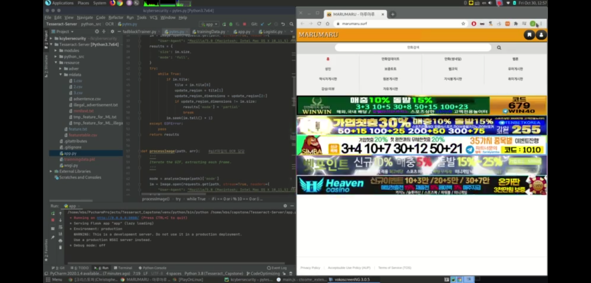
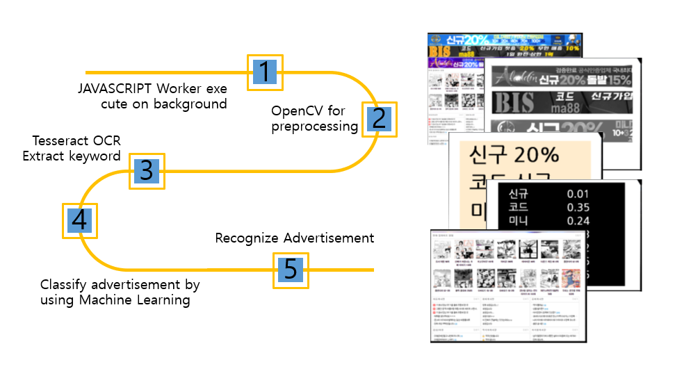

# M-Block
키워드 인식 기반 인공지능 솔루션을 이용한 웹 광고 차단 확장프로그램입니다.

### 실행 동작 결과

https://youtu.be/H3M9fbpcbno
테스트 결과 1000건의 데이터에 대해 70.7%의 적중률을 보임

  
### 동작 방식
1. 웹 화면에 있는 이미지 인식
2. 이미지에서 키워드를 추출
3. 추출한 키워드의 내용, 빈도를 서버에 있는 광고 키워드와 비교
4. 유해광고라고 판단되는 리스트 객체 수신
5. 해당되는 이미지들을 삭제  

